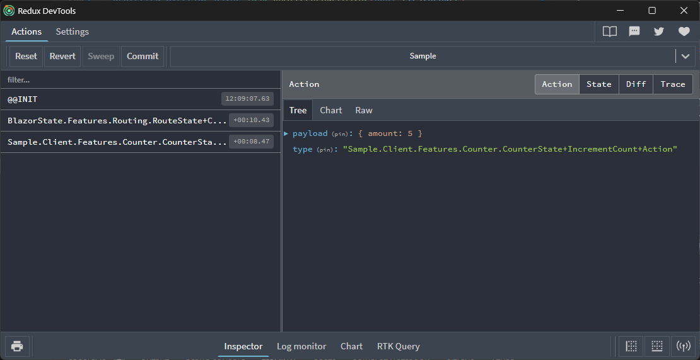

# TimeWarp.State Blazor Hosted WebAssembly Tutorial

Integrate TimWarp.State into a `Blazor App`.

## Prerequisites

- [.NET 8.0 SDK](https://dotnet.microsoft.com/download).

## Creating the Project

1. Create a new Blazor WebAssembly project: `dotnet new blazor --interactivity Auto -n Sample`.
1. Navigate to the new project: `cd Sample`
1. Test the application: `dotnet run --project ./Sample/Sample.csproj`
1. Open the URL shown in the command output (e.g., <http://localhost:5256>) and test the counter functionality. Note: Your URL may differ.

> [!NOTE]
   > The counter resets to zero when you navigate away and return because each time you leave the page, 
   the counter component is destroyed. 
   When you return, a new instance of the component is created, starting the count afresh. 

## Add TimeWarp.State

Add the TimeWarp.State NuGet package to the `Sample.Client` project.  
   `dotnet add ./Client/Sample.Client.csproj package TimeWarp.State`

## Solution Structure

Organize Features[^1] by the `State` they act upon:

1. Create `Features` folder in the Client project.
2. Inside `Features`, add a `Counter` folder.

## Add CounterState

Inside `Counter`, add `CounterState.cs`:

- Define `CounterState` as a partial class inheriting from `State<CounterState>`.
- Override `Initialize()` to set `Count` to 3.

```csharp
namespace Sample.Client.Features.Counter;

using BlazorState;

public partial class CounterState : State<CounterState>
{
    public int Count { get; private set; }
    public override void Initialize() => Count = 3;
}
```

## Configure Services

In `Program.cs` of `Sample.Client`:

- Add required usings.
- Configure BlazorState options with the assemblies to scan.

```csharp
using BlazorState;
using Microsoft.AspNetCore.Components.Web;
using Microsoft.AspNetCore.Components.WebAssembly.Hosting;
using Sample.Client;
using System.Reflection;

var builder = WebAssemblyHostBuilder.CreateDefault(args);
builder.RootComponents.Add<App>("#app");
builder.RootComponents.Add<HeadOutlet>("head::after");

builder.Services.AddScoped(sp => new HttpClient { BaseAddress = new Uri(builder.HostEnvironment.BaseAddress) });

builder.Services.AddBlazorState
(
    options =>
        options.Assemblies =
        new Assembly[]
        {
            typeof(Program).GetTypeInfo().Assembly,
        }
);

await builder.Build().RunAsync();
```

## UI Integration

Modify `Pages/Counter.razor`:
 - Inherit from `BlazorStateComponent`.
 - Add a property to access `CounterState`.
 - Update display to use `CounterState.Count`
 - Remove the `IncrementCount` implementation.  
  
 1. Notice that inside the `IncrementCount` method the `currentCount`can no longer be incremented. The `CounterState` class is immutable from the outside.
 So lets comment out that line.

The code should look as follows:

```csharp
@page "/counter"
@using BlazorState
@using Sample.Client.Features.Counter

@inherits BlazorStateComponent

<PageTitle>Counter</PageTitle>

<h1>Counter</h1>

<p role="status">Current count: @currentCount</p>

<button class="btn btn-primary" @onclick="IncrementCount">Click me</button>

@code {
    CounterState CounterState => GetState<CounterState>();

    private int currentCount => CounterState.Count;

    private void IncrementCount()
    {
        // Empty for now.
    }
}
```

This binds the counter's UI to the state managed by TimeWarp.State.


## Implementing State Mutation through Actions and Handlers
Changes to state are done by sending an Action through the pipeline. The Action is then handled by a Handler which can freely mutate the state.

> [!Warning]
> State must only be modified through designated handlers.
> Direct mutation of state outside these handlers is not allowed.
> Maintain encapsulation by designing the state's public interface to be unmodifiable externally, with handlers implemented as nested classes within the state they modify.

## Action and Handler

Create `CounterState.IncrementCount.cs` in `Features/Counter/Actions`.

In this file, the `IncrementCount.Action` class should:

* Be a nested class within `IncrementCount`, which in turn is a static class nested in `CounterState`.
* Inherit from `IAction`.
* Be part of the `Sample.Client.Features.Counter` namespace.
* Contain the `Amount` property.

The `IncrementCount.Handler` class should:

* be a nested class of the state it will mutate `CounterState`
* Be a nested class within `IncrementCount.
* Inherit from `BlazorState.Handlers.ActionHandler`.
* The generic parameter is the Request Type `Action`
* Override the `Handle` method to mutate state as desired:

```csharp
namespace Sample.Client.Features.Counter;

using BlazorState;
using MediatR;

public partial class CounterState
{
  public static class IncrementCount
  {
    public class Action : IAction
    {
      public int Amount { get; set; }
    }

    public class Handler : ActionHandler<Action>
    {
      public Handler(IStore aStore) : base(aStore) { }
      
      CounterState CounterState => Store.GetState<CounterState>();

      public override Task Handle(Action aAction, CancellationToken aCancellationToken)
      {
        CounterState.Count += aAction.Amount;
        return Task.CompletedTask;
      }
    }
  }
}
```

## Send action through the pipeline

To Send the action to the pipeline when the user clicks the Click me button, In Pages/Counter.razor update the IncrementCount function as follows:

```csharp
async Task IncrementCount()
{
  await Mediator.Send(new CounterState.IncrementCount.Action { Amount = 5 });
}
```

## Validate

Execute the app and confirm that the "Click me" button properly increments the value.
And when you navigate away from the page and back the value is still there.

## ReduxDevTools JavaScript Interop and RouteState

To [enable ReduxDevTools](xref:BlazorState:AddReduxDevTools.md) update `Program.cs` as follows:

```csharp
using BlazorState;
using Microsoft.AspNetCore.Components.Web;
using Microsoft.AspNetCore.Components.WebAssembly.Hosting;
using Sample.Client;
using System.Reflection;

var builder = WebAssemblyHostBuilder.CreateDefault(args);
builder.RootComponents.Add<App>("#app");
builder.RootComponents.Add<HeadOutlet>("head::after");

builder.Services.AddScoped(sp => new HttpClient { BaseAddress = new Uri(builder.HostEnvironment.BaseAddress) });

builder.Services.AddBlazorState
(
    options =>
    {
        options.UseReduxDevTools(); // <== Add this line
        options.Assemblies =
        new Assembly[]
        {
            typeof(Program).GetTypeInfo().Assembly,
        };
    }
);

await builder.Build().RunAsync();    
```

To facilitate JavaScript Interop, enable ReduxDevTools, and manage RouteState, add `App.razor.cs` in the same directory as `App.razor` as follows:

```csharp
namespace Sample.Client;

using System.Threading.Tasks;
using BlazorState.Pipeline.ReduxDevTools;
using BlazorState.Features.JavaScriptInterop;
using BlazorState.Features.Routing;
using Microsoft.AspNetCore.Components;

public partial class App : ComponentBase
{
  [Inject] private JsonRequestHandler JsonRequestHandler { get; set; } = null!;
  [Inject] private ReduxDevToolsInterop ReduxDevToolsInterop { get; set; } = null!;

  [Inject]
  [System.Diagnostics.CodeAnalysis.SuppressMessage
    (
      "CodeQuality", 
      "IDE0051:Remove unused private members", 
      Justification = "It is used, the constructor has side effects "
    )
  ]
  private RouteManager RouteManager { get; set; } = null!;

  protected override async Task OnAfterRenderAsync(bool firstRender)
  {
    await ReduxDevToolsInterop.InitAsync();
    await JsonRequestHandler.InitAsync();
  }
}
```

Now run your app again and then Open the Redux Dev Tools (a tab in Chrome Dev Tools) and you should see Actions as they are executed.


If you inspect the State in the DevTools you will also notice it maintains the current Route in RouteState.


Congratulations that is the basics of TimeWarp.State.


[^1]: https://github.com/TimeWarpEngineering/timewarp-architecture/blob/master/Source/TimeWarp.Architecture.Template/templates/TimeWarp.Architecture/Documentation/Developer/Conceptual/ArchitecturalDecisionRecords/ProjectStructureAndConventions/ProjectStructureAndConventions.md
